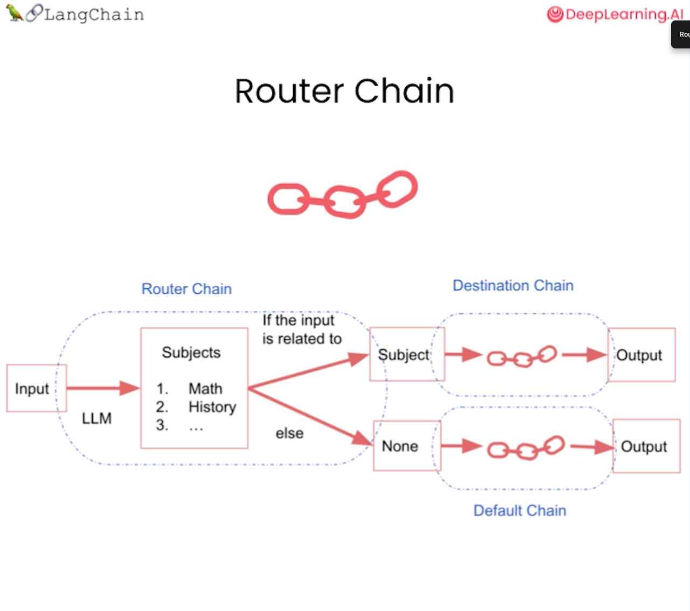

# LangChain for LLM Application Development Summary

This repository contains notebooks that guide you through different concepts of LangChain, including prompt parsing, memory management, chains, Q&A, evaluation, and agents. Below is an overview of each lesson along with visual references and example code snippets.

## 1. Model Prompt Parser (L1-Model_prompt_parser.ipynb)
This notebook introduces the concept of parsing prompts for Large Language Models (LLMs). The key topics include:
- Understanding prompt templates.
- Using LangChain’s built-in prompt tools.
- Formatting prompts dynamically.
- Output parsers and response schemas.

### Example:
```python
from langchain.prompts import PromptTemplate
from langchain.output_parsers import ResponseSchema, StructuredOutputParser

# Define a template
prompt = PromptTemplate(
    input_variables=["name"],
    template="Hello, {name}! How can I assist you today?"
)

# Define response schema
response_schema = ResponseSchema(name="response", description="The AI's reply to the user.")
output_parser = StructuredOutputParser(response_schemas=[response_schema])

formatted_prompt = prompt.format(name="Alice")
print(formatted_prompt)
print(output_parser.get_format_instructions())
```

## 2. Memory in LangChain (L2-Memory.ipynb)
Memory is essential for maintaining context in conversations. This notebook covers:
- Different types of memory mechanisms in LangChain:
  - **ConversationBufferMemory**: Stores all messages.
  - **ConversationBufferWindowMemory**: Keeps only the last K interactions.
  - **ConversationTokenBufferMemory**: Uses token length to decide when to flush memory.
  - **ConversationSummaryMemory**: Summarizes the conversation over time.
- Additional memory types like vector memory and entity memory.


### Example:
```python
from langchain.memory import ConversationBufferMemory

memory = ConversationBufferMemory()
memory.save_context({"input": "Hello!"}, {"output": "Hi there!"})
print(memory.load_memory_variables({}))
```

## 3. Chains in LangChain (L3-Chains.ipynb)
Chains allow linking multiple components together. This notebook explains:
- **Simple Sequential Chain**: Where the output of one chain becomes the input for another.
- **Router Chain**: A more complex structure that routes input based on its subject.




### Example:
```python
from langchain.chains import MultiRouteChain
from langchain.llms import OpenAI

llm = OpenAI()
router = {
    "math": lambda x: f"Solving math problem: {x}",
    "history": lambda x: f"Retrieving historical facts about: {x}",
}
router_chain = MultiRouteChain(router=router, default_chain=lambda x: f"General answer: {x}")
print(router_chain.run("Tell me about WW2"))
```

## 4. Q&A with LangChain (L4-QnA.ipynb)
This notebook walks through building a question-answering system using LangChain:
- How to retrieve answers from documents using LLMs.
- Connecting LangChain to external sources like databases.
- Implementing memory for contextual answers.

### Example:
```python
from langchain.chains import RetrievalQA
from langchain.vectorstores import FAISS
from langchain.embeddings import OpenAIEmbeddings

retriever = FAISS.load_local("./vector_store", OpenAIEmbeddings()).as_retriever()
qa = RetrievalQA(retriever=retriever)
response = qa.run("What is LangChain?")
print(response)
```

## 5. Evaluation in LangChain (L5-Evaluation.ipynb)
Evaluation is crucial to improving AI performance. This lesson covers:
- Differences between **manual evaluation** (human-labeled datasets) and **automated evaluation**.
- Creating an evaluation dataset manually vs. generating one.
- Running evaluations with LangChain tools.

### Example:
```python
from langchain.evaluation import load_evaluator

# Manual evaluation example
manual_data = [{
    "input": "What is LangChain?",
    "expected_output": "LangChain is a framework for developing LLM-based applications."
}]

# Automated evaluation example
predictions = ["LangChain is an LLM framework."]
references = ["LangChain is a framework for developing LLM-based applications."]

evaluator = load_evaluator("qa")
result = evaluator.evaluate(predictions=predictions, references=references)
print(result)
```

## 6. Agents in LangChain (L6-Agents.ipynb)
Agents allow dynamic decision-making in LangChain applications. Topics include:
- Using tools within an agent to perform specific tasks.
- Implementing reasoning and planning for LLMs.
- Creating a multi-step agent workflow.

### Example:
```python
from langchain.agents import initialize_agent, AgentType
from langchain.llms import OpenAI
from langchain.tools import Tool

tool = Tool(
    name="Calculator",
    func=lambda x: eval(x),
    description="A simple calculator tool."
)
agents = initialize_agent([tool], OpenAI(), agent=AgentType.ZERO_SHOT_REACT_DESCRIPTION)
print(agents.run("What is 3+5?"))
```

---
This repository provides a structured way to understand and build with LangChain. Feel free to explore each notebook to get hands-on experience!

